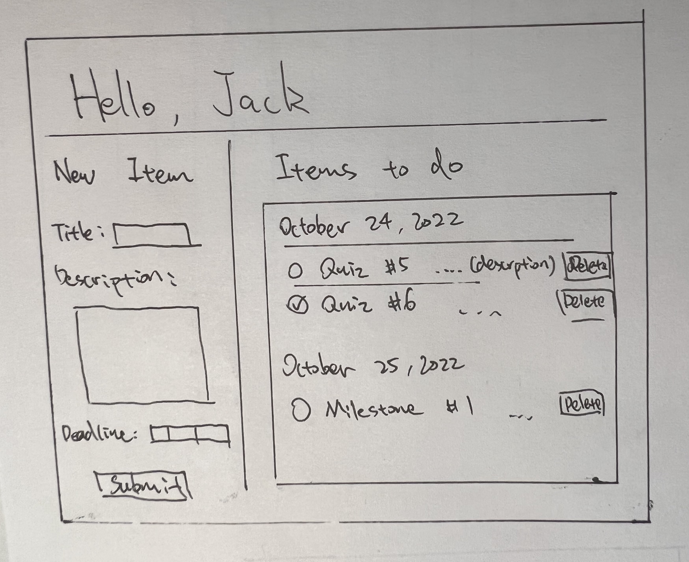

# TaskMan

## Overview

When there are too many plans in our heads, we often forget things, so it is important to record them somewhere, so you will not completely forget about them. TaskMan can definitly help with reminding what tasks need to be completed.

TaskMan is a task managment / to-do list application. Users can add and delete tasks that needs to be completed in the future with a deadline. Users need to register an account, and when they log into their account, a list of their to-do items will be displayed in the order of the deadline. For each to-do item, user can add a title, a deadline, and some descriptions. They can also edit the items whenever they want.

## Data Model

The application will store Users, Items

* Users can have multiple items

An Example User:

```javascript
{
  _id: // an unique object id for the user
  username: // username of the account
  items: // an array of references to Item documents
  salt: // salt for hashing the password
  hash: // a password hash
}
```

An Example Item:

```javascript
{
  _id: // unique object id for the item
  title: // title of the task
  description: // description of the task
  deadline: // deadline of the task
  user: // reference to the object id of the user
  createdAt: // timestamp for when the item is created
  updatedAt: // timestamp for when the item is updated
}
```

## [Link to Commented First Draft Schema](db.mjs) 

## Wireframes

/home - The home page that shows the to do list for current user



/edit - page for editing specific items


/login - page for user to log in


/signup - pape for user to create a new account


## Site map


## User Stories or Use Cases

1. as non-registered user, I can register a new account with the site
2. as a user, I can log in to the site
3. as a user, I can create a new to-do item
4. as a user, I can edit the information of the items.
5. as a user, I can delete items.
6. as a user, I can view items in the order of the deadlines, and items already ended will be automatically removed.

## Research Topics

* (4 points) **React**
    * I'm going to use React as the frontend framework. 
    * React is declarative, which makes code easier to read and debug.
    * Since it will be learned in class, and I have a little bit of experience with it, it should worth 4 points.
    
* (2 points) **Semantic UI**
    * I am goint to use this CSS framework for the UI.
    * It can help with building a web app with neat web pages.
    * CSS framework should worth 2 points

* (3 points) **dotenv**
    * Configuration management using dotenv.
    * It stores default configuration that shouldn't be accessed by other people.
    * Configuration managment modules worth 3 points
    
* (3 points) **Passport-Local Mongoose**
    * User authentication using passport local strategy.
    * A plugin that adds hash and salt into user schema, and uses passport local strategy to verify and create user session.
    * A passport authentication uses predefined strategy and serialization. It should worth 3 points.

12 points total out of 10 required points

## [Link to Initial Main Project File](app.mjs) 

## Annotations / References Used

1. [Reactjs tutorial](https://reactjs.org/tutorial/tutorial.html)
2. [Sematic UI tutorial](https://semantic-ui.com/introduction/getting-started.html)
3. [dotenv doc](https://www.npmjs.com/package/dotenv)
4. [Passport.js](https://www.passportjs.org/)
5. [Passport-Local Mongoose Example](https://github.com/saintedlama/passport-local-mongoose/tree/main/examples/login)


